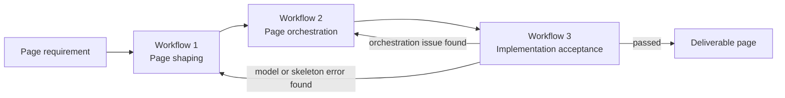
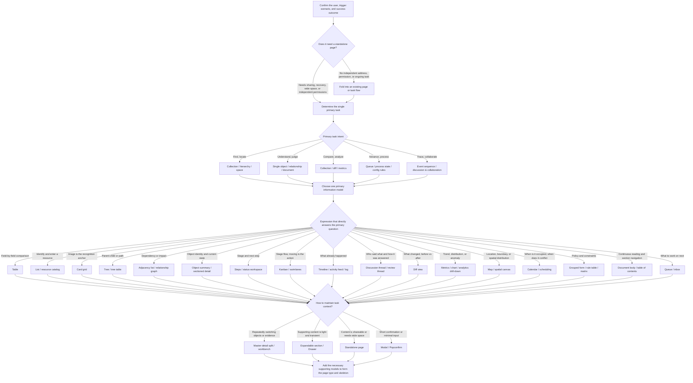
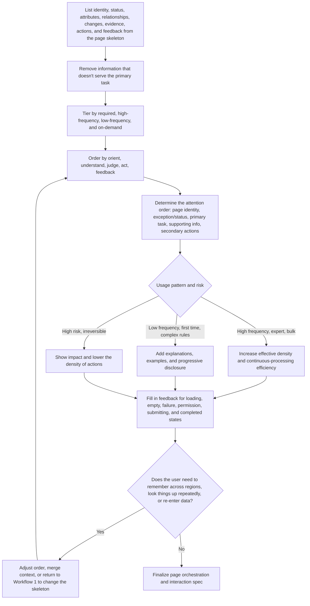
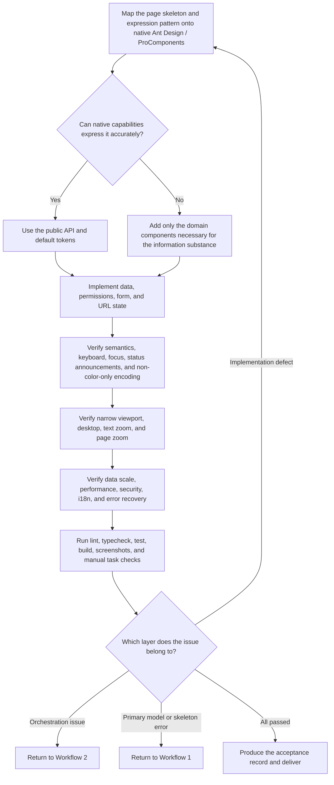

# Information-Dense Page Organization Guide (Ant Design)

> For product managers, designers, frontend developers, and AI coding tools: identify the core model of business information, then use the right expression pattern and native Ant Design Pro / ProComponents to organize pages so users can understand, judge, and act continuously.
>
> **Scope: information-dense pages** — pages where the user must understand multiple objects, multiple states, and the relationships between them within one screen, then judge and act on that understanding. The criterion is the density and structure of the information, not the product's form factor or how it's procured: admin backends, monitoring and observability consoles, data and analytics tools, ops consoles, review and ticketing systems, and trading/scheduling terminals all qualify. Marketing landing pages, content-consumption pages, and single-conversion form flows are out of scope — their success depends on persuasion and conversion, not on whether the user can judge accurately amid dense information.
>
> This handbook constrains information expression, information organization, page orchestration, and task flow — it is not a visual style spec, nor a primitive-component usage manual. The default styles and component behavior of `antd` (Ant Design) and `@ant-design/pro-components` are the baseline; without an explicit brand, accessibility, or business-expression need, do not modify the theme or override component styles. An existing project's component versions, business terminology, and neighboring pages take precedence over the examples here.
>
> **Version: 2026.09.04** (initial release). See [CHANGELOG](./CHANGELOG.md) for the change history. This repository is the single source of truth; if this spec is referenced from another repository, that copy is read-only — edits must be made here.

---

## 1. How to use this guide

### 1.1 Execution constraints

This guide only addresses the information model, page skeleton, information distribution, and task flow. When implementing, follow these minimum constraints:

- Confirm the user, the primary task, the primary information model, and the success outcome before choosing a page type or components.
- Source-of-truth priority: product rules and permission model → the current project's implementation and dependencies → this guide → official docs → historical examples.
- A page has exactly one primary model; the title, status, primary action, and core judgment information should form a clear order on the first screen.
- Do not organize a page around API fields or a component inventory; do not use Card, color, or overlays to paper over information-hierarchy problems.
- After implementation, verify only: does the information distribution hold up, can the primary task be completed, and do narrow viewports and keyboard operation break the structure.

### 1.2 Three-workflow process

Page design does not use one decision tree that tries to answer everything, nor does it split every quality attribute into its own process. It converges into three stages — "page shaping, page orchestration, implementation acceptance." Chapters 2, 3, and 4 are the rule libraries for each stage, consulted as needed; Chapter 5 is the final check-in point.

| Stage | Output | Chapter |
|---|---|---|
| Workflow 1: Page shaping | Primary task, primary information model, expression pattern, page type and skeleton | Chapter 2 |
| Workflow 2: Page orchestration | Content priority, attention order, density, task flow, and feedback plan | Chapter 3 |
| Workflow 3: Implementation acceptance | Component mapping, adaptation plan, acceptance result | Chapters 4–5 |



The three workflows observe three boundaries:

1. Workflow 1 determines page structure; Workflow 2 must not hide information or add containers to mask structural errors; Workflow 3 must not use custom styling to mask orchestration errors.
2. A page can contain multiple information models, but only one model may determine the first screen, the primary expression, and the primary action.
3. `Tabs`, `Card`, `Drawer`, and `Modal` are orchestration containers, not business information models, and cannot substitute for choosing an expression pattern.

---

## 2. Workflow 1: Page shaping

This workflow only determines the information substance, page skeleton, and container relationships — it does not handle density, color, spacing, or loading states.

### 2.1 Design goals

The value of an information-dense page isn't how much information it holds, but whether the user can judge accurately from dense information under limited attention and complete the task. Evaluate a page by asking, in order:

1. Can the user quickly confirm where they are and what object they're working with?
2. Can the user find the information and actions needed for the primary task?
3. Can the user judge the current state, the effect of an action, and the next step?
4. Can the user recover from an error, insufficient permissions, or a system exception?
5. Can users of different abilities, devices, and input methods complete the same core task?

| Principle | Requirement |
|---|---|
| Task first | Organize the page around the user's goal, not around backend APIs, database tables, or org structure |
| Recognition over recall | Show current context, selected conditions, units, and state; don't make the user remember an ID, a rule, or a prior input across pages |
| Progressive disclosure | Show high-frequency, decision-relevant information by default; expand low-frequency fields, explanations, and advanced actions on demand |
| Consistent and predictable | Use the same name and behavior for the same object, action, state, and feedback across the whole product |
| Prevent errors first | Reduce errors with constraints, defaults, previews, impact scope, and permission hints — don't rely only on after-the-fact error messages |
| User in control | Show progress for long operations; important changes can be cancelled, undone, or explicitly confirmed; never create a dead end |
| Continuity of state | After refresh, back, retry, or re-login, preserve still-valid filters, position, and drafts wherever possible |
| Accessibility is a baseline | Don't treat accessibility as a patch applied after the visuals are done; design semantics, keyboard, focus, contrast, and copy together |
| Native first | Keep default styles and component behavior consistent with Ant Design Pro; prefer the component's own layout and appearance mechanisms (Card, Row/Col, List, Descriptions, etc.) over hand-written style fixes, and spend design effort on information selection and organization instead |

### 2.2 Deriving the expression pattern from the domain model

Page form is not the starting point. Complete a four-step derivation before designing:

```text
Domain model: what objects, relationships, events, and rules actually exist in the system?
    ↓
User task: does the user need to find, understand, compare, process, collaborate, or trace?
    ↓
Information model: is the information needed for the task a collection, hierarchy, relationship, process, or another structure?
    ↓
Expression pattern: which structure lets the user judge and act with the fewest mental conversions?
```



Do not choose a table just because an API returns an array, and do not default to a generic detail page just because the route carries an ID. The same domain object can have different expressions under different tasks: an Issue is a collection when querying, a status flow when processing, a discussion thread when collaborating, and an event sequence when auditing.

### 2.3 Information model ↔ expression skeleton reference

What actually needs distinguishing is the **structural difference in the expression skeleton**, not the business name. The same skeleton recurring across different business domains is expected, not duplication in page design — don't pad out "coverage" by treating the same skeleton applied to a different business as a new type worth documenting separately.

Cross-referencing common forms in mature information-dense products (GitHub, Jira/Atlassian, AWS Console, Stripe, Salesforce, Datadog, PagerDuty), the following skeletons emerge; other common pages are domain-specific instances of them:

| Information model | What the user needs to understand | Expression skeleton | Preferred component combination | Common domain instances |
|---|---|---|---|---|
| Single object | Identity, status, attributes, capabilities | Sectioned detail | `PageContainer` + `ProDescriptions` + `Tabs` | Release detail, application detail |
| Collection | Differences across many objects of the same kind | 2D comparison table | `ProTable` (query/sort/paginate/bulk actions/clear-no-match) | Release lists, billing, report lists |
| Collection | Discover and re-enter from a large resource pool | Catalog and discovery | Search + faceted filters (`Select`/`TreeSelect`) + `ProList` + favorites/saved views | Component/service catalog |
| Collection | Browsing and picking where the image is the recognition anchor | Card grid | Grid (`Row`/`Col` or `ProList` grid) + card + search/sort + `Pagination` | Product walls, asset libraries, template marketplaces |
| Hierarchy | Parent-child, containment, path | Hierarchy tree | `Tree` + breadcrumb + master-detail `Table` | Org structure, resource directory trees |
| Relationship network | How objects depend on or reference each other | Relationship list | Upstream/downstream adjacency list + impact-propagation hints; use a graph only when path/propagation itself is the judgment basis | Dependency topology |
| Process & state | Which step it's on now, what's next | Step wizard | `Steps` + step-by-step form + high-risk double confirmation + `Result` | Release approval flow, creation wizard |
| Process & state | Why it stalled, where it failed | Trace drill-down | Stage summary → per-step result → progressive disclosure of raw logs | Distributed tracing, audit drill-down |
| Process & state | Which stage an object is in now, how it advances | Kanban | Column = stage + card carries identity and blockers + drag-to-act + in-column ordering | Requirement boards, hiring pipelines, content scheduling |
| State continuity | Is it healthy now, how wide is the blast radius | Status wall | Global `Alert` + component status list + event `Timeline` | Service status pages |
| Event sequence | What happened, in what order, triggered by whom | Event timeline | `Statistic` summary + `Timeline` + type filter + `Collapse` log | Audit logs, changelogs |
| Discussion & collaboration | Who proposed what, how it was answered, what conclusion formed | Discussion thread | `List` + `Avatar` + `Typography` + editor | Review comments, change discussions |
| Document & content | Continuous reading, section navigation, understanding body text | Continuous document | `Typography` + `Anchor` outline + `Affix` | Knowledge-base docs, spec handbooks |
| Version & diff | What changed, where the impact lands | Side-by-side comparison | Comparison scope + `Statistic` summary + side-by-side `Table` or a semantic diff view | Config version comparison, release diffs |
| Space & location | Where the object is, what its boundaries and distribution look like | Map / canvas | Native page shell + purpose-built visualization | Data-center topology, regional distribution |
| Time & scheduling | When something is occupied by whom, when it conflicts | Calendar / scheduling | `Calendar` or a time grid + event blocks + conflict hints | Shift schedules, marketing calendars, resource booking |
| Metrics & distribution | Trend, anomaly, composition, correlation | Dashboard / overview | `Statistic` + `Line`/`Column` + to-do list + `Alert` | Delivery overviews, on-call home pages |
| Queue | What to work on next, what the priority is | Master-detail workspace | Left queue (`ProList`/`ProTable`) + right detail + `Drawer` | Issue workbenches, approval inboxes |
| Configuration & rules | Current policy, applicable scope, conflicts and results | Configuration form | `ProForm` grouping + `Transfer`/`Slider`/`Switch` + impact `Alert` | Release policy, permission/authorization config |

These models can be combined, but every page must have exactly one primary model. Supporting models may only aid understanding or manipulation of the primary model — they cannot compete for the first screen. For example, a Pull Request can use "changed object" as its primary model, with discussion thread, checks process, and file diff as peer views; it should not be reduced to a single attribute detail card. This repository's `fe-page-guide-antd-demo/` directory provides runnable domain instances for the skeletons above (see `fe-page-guide-antd-demo/README.md` for the mapping).

### 2.4 Rules for choosing an expression pattern

- Use a table for field-by-field comparison across objects; use a list when the task is only to identify and enter an object; use a tree when the structural order is meaningful — don't force everything into a table.
- Use a timeline to convey order of occurrence; use Steps to convey the current stage and subsequent steps; the two must not be swapped just because they look similar.
- Use Kanban when objects advance through discrete stages and "moving" itself is the action; if columns are just different filter conditions, switch to view toggles or filters instead — don't disguise a filter as a stage with Kanban.
- Use a calendar or time grid when the judgment depends on "is this time slot occupied, does it conflict"; use a timeline when only sequence matters — the two have different time semantics and are not interchangeable.
- Preserve document structure when content needs continuous reading and referencing; don't break every paragraph into a Card or a key-value field.
- Preserve discussion context when understanding multiple viewpoints and their replies; don't flatten comments into an undifferentiated operation log.
- Express before/after diffs directly when the task is to see "what changed" — don't make the user memorize a comparison across two detail pages.
- Use a graph to explore relationships or spatial position only when the topology itself affects judgment; otherwise a grouped list conveys upstream/downstream more efficiently.
- Use native components directly wherever they express the need accurately; when there is no adequate native expression, a domain-specific view is allowed. Do not distort the information model just to insist on "native components only."

### 2.5 Page shell and hierarchy

```text
┌ App navigation ───────────────────────────────────────┐
│ Breadcrumb / page location                            │
│ Page title + status + short description    [Primary action] │
├───────────────────────────────────────────────────────┤
│ Key alert or pending item (only when it has action value)   │
│                                                       │
│ Query / local navigation / toolbar                    │
│ Primary content area                                   │
│                                                       │
│ Pagination / result summary                            │
└───────────────────────────────────────────────────────┘
```

- The app shell has three parts: app-level navigation, header, and footer. The header carries cross-page global context (persistently visible selectors like environment, organization) and global actions; the footer carries secondary information like version and data scope. Business pages must not reimplement these regions.
- Use `ProLayout` for app-level navigation and `PageContainer` for the page title, breadcrumb, and content boundary — don't rebuild a shell inside a business page.
- Keep primary page content stably left-aligned. Don't center data, forms, or long text; centering is only for short empty states, result pages, and similarly explicit scenarios.
- The title region holds only object identity, status, necessary description, and the primary action. Don't crowd stat cards, filter forms, or long descriptions into the title region.
- Keep related content close together and separate unrelated content with spacing and grouping. Prefer whitespace, headings, and dividers to establish hierarchy; a Card should only represent a genuinely independent content container — never nest a Card inside a Card. Group form fields internally with a group heading or divider instead.
- Sticky page headers, bottom action bars, and floating controls must never obscure content or keyboard focus.

Hierarchy constraints:

- App navigation expresses cross-object modules; in-page Tabs express peer views of the same object; local anchors express sections of a long page.
- Avoid having three competing navigation systems visible in the same region at once (e.g. sidebar + top Tabs + Tabs inside a Card).
- Modal and Drawer are not a new navigation layer. When link-copying, browsing history, complex comparison, or ongoing work is needed, use a standalone route instead.
- Breadcrumbs generally shouldn't exceed 4 levels; when they run deeper, fix the information architecture rather than truncating it into something unreadable.

A route should have one primary task and one primary information model, but it can combine multiple expression patterns. GitHub's Repository, Pull Request, Actions, and Projects pages look different precisely because they're organized around document-and-hierarchy, change-and-discussion, process-and-log, and workflow-and-kanban respectively — not because they all default to a uniform list-detail pattern.

---

## 3. Workflow 2: Page orchestration



### 3.1 Information composition and default placement

Select what a page shows from the following information categories based on the task, not by dumping every API field in order:

| Information | Question it answers | Organization requirement | Default location | Where it must not go |
|---|---|---|---|---|
| Identity | What is this | Name, stable identifier, and owning context shown close together | Page title, object summary | A deep Tab or the last column of a table |
| Status | How is it now | Current value, reason, update time, and reachable next states linked as needed | Title region, summary region, status workspace | Only discoverable in detail fields |
| Attributes | What are its characteristics | Grouped by user understanding, not laid out by database or DTO order | Detail body, grouped fields, comparison table | Flattened in API-field order |
| Relationships | Who is it related to | Distinguish ownership, dependency, reference, and impact scope as different semantics | Relations region, adjacency list, standalone Tab | Mixed with attribute fields into one big table |
| Changes | What changed compared to before | Express the diff, the actor, the time, and the impact — not just the final value | Diff region, timeline, version comparison | Showing only the final value after the change |
| Evidence | Why this judgment can be drawn | Place logs, check results, sources, or rules near the judgment | Near the judgment result, expandable log | A standalone log page far from the conclusion |
| Actions | What the user can do now | Keep actions close to the object they act on; hierarchy reflects frequency, value, and risk | Primary action in the title region or first screen; secondary actions in a local toolbar | Primary action buried in "more" or the page footer |
| Feedback | What result the action produced | State success, partial success, failure, and next steps while preserving task context | Near the action, in a result region | A global toast detached from context |

Region assignment should also follow these rules:

- App-level navigation expresses cross-object modules only; the page title region expresses only the current object's identity, status, necessary description, and primary action.
- Use Tabs for peer information about the same object; use anchors for sections within long content; don't let a sidebar, top Tabs, and Tabs inside a Card all carry the same layer of navigation at once.
- Keep information needed for a judgment close to that judgment's result; raw logs, full requests, and low-frequency fields default to progressive disclosure and shouldn't compete with the summary for first-screen space.
- Relationships, changes, and evidence should go into the primary content if they change the user's decision; move them to a secondary region if they're only background.
- Each piece of information keeps exactly one authoritative display location. Other locations may only show a summary, a status, or an entry point with a clear link to the authoritative location.
- Use a standalone route for content that needs sharing, recovery, wide space, independent permissions, or ongoing work; reserve Modal/Drawer for short confirmations and lightweight context.
- Prefer stable business objects for navigation names — "Release," "Application," "Member" — not vague names like "General Management."
- The page title describes the current object or task; the breadcrumb describes location; Tabs describe different information facets of the same object. Don't repeat the same sentence across all three.
- When permissions affect an action, hide capabilities the user can never obtain; for permissions the user might gain or is temporarily missing, keep a disabled entry point and explain the reason and how to request access.

### 3.2 Reading order and attention

The default reading order should be kept as:

```text
Page identity
→ Current status / exception
→ Primary task and primary action
→ Core information needed for judgment
→ Relationships, changes, and evidence
→ Secondary information and low-frequency actions
```

Applied to common pages, the default region order is an instance of this sequence, not a template to be pasted in:

| Common page | Primary task | Default region order |
|---|---|---|
| Overview page | Spot anomalies, understand scope, enter a task | Summary → pending/anomalies → trend → recent activity |
| List page | Locate, compare, and bulk-process objects | Title/primary action → query → table/list → pagination |
| Catalog/discovery page | Find, discover, and re-enter a large set of resources | View navigation → search/faceted filters → resource results → saved views |
| Detail page | Judge a single object and act on it | Identity/status/primary action → core attributes → relationships/history |
| Create/edit page | Enter or modify information accurately | Goal statement → grouped form → validation summary → submit region |
| Step flow | Complete a long task with dependencies | Steps and progress → current step → result confirmation |
| Workbench | High-frequency cross-object processing task | Queue/navigation → primary work area → contextual detail/actions |
| Document page | Continuous reading, understanding, and referencing content | Title/metadata → table of contents → body → related content |
| Activity page | Trace an event or collaboration process | Status summary → timeline/discussion thread → input and actions |
| Comparison page | Understand what changed between versions, objects, or policies | Comparison scope → diff summary → diff body → processing actions |
| Hierarchy page | Browse and operate on a catalog, org, or dependency structure | Path/scope → tree or master-detail structure → current node's content |

Attention-allocation rules:

- A page has exactly one visual primary heading (usually `h1`); section headings progress by semantic order, not by font size pretending to be hierarchy.
- At most one `type="primary"` button per task region. The primary button represents the current most-likely, highest-value next step — not "most dangerous" or "most permanent."
- Dangerous actions use dangerous semantics but shouldn't permanently hold the highest visual weight; they usually belong in secondary actions or a "more" menu.
- Warning and error colors are only for states that genuinely need the user's attention. A normal state shouldn't be blanketed in green; status can be conveyed with short text, an icon, and a low-intensity tag together.
- Badge, Tag, Alert, and Notification all consume attention. Only emphasize information that would change the user's judgment or action.

### 3.3 Information density

Information density isn't how many controls fit per unit area — it's how much effective, judgment-usable information the user can take in within one field of view. Tightening spacing only raises visual density; effective information density only rises by removing irrelevant information, establishing comparison relationships, and reducing the need to look back and forth.

| Density | Where it applies | Design emphasis |
|---|---|---|
| Spacious | First-time use, low-frequency configuration, high-risk confirmation | More explanation, larger group spacing, a clear impact preview |
| Standard | Most lists, details, and forms | Balance scannability against information per screen |
| Compact | High-frequency expert workbenches — monitoring, ops, audit | Stable column widths, short copy, keyboard efficiency, saveable views |

- Density isn't shrinking font size and hit targets together. You can tighten container whitespace and line height, but body readability, focus, and hit-target size must still meet the bar.
- Use at most two adjacent density levels on one page — e.g., a compact table inside a standard page; don't let every region invent its own scale.
- For expert users, prefer column management, saved views, bulk actions, and shortcuts over indiscriminately showing more content.

Different page regions should carry different density:

| Region | Recommended density | Why |
|---|---|---|
| App navigation | Low | Helps orientation; must not compete with business content for attention |
| Page title and object summary | Low–medium | Quickly confirm the object, scope, status, and primary action |
| Query and view controls | Medium | Convey the current observation scope with minimal space |
| Core comparison/work area | Medium–high | Carries scanning, comparison, editing, or continuous processing |
| Evidence and context | Medium | Provided when a judgment needs it; must not drown out the primary work area |
| Final actions and feedback | Low | Stay positionally stable to avoid mis-taps and missed results |

### 3.4 Carrying hierarchy through the default visual language

- Use Ant Design's default typography, sizes, line height, corner radius, shadows, colors, and spacing; don't build a second visual system for a single page.
- Express visual hierarchy exclusively through the components' own capabilities — never hand-write font size, weight, or color values in business pages. Look up the need in this table before writing anything:

| Want to express | Use this component capability | Don't write this |
|---|---|---|
| More/less important | `Typography.Text`'s `strong`, `type="secondary"` | `fontWeight: 600`, `fontSize: 15` |
| A more compact block | The component's `size="small"` (`Card`, `List`, `Table`, `Form`, etc.) | Overriding component padding, line height |
| Semantic status color | `Tag`/`Alert`/`Badge`'s `color`, `type`, `status` | A hardcoded value like `#faad14` |
| Headings and sections | `Typography.Title`'s `level`, `PageContainer`'s title region | Faking heading hierarchy with font size |
| In-line alignment and distribution | `Flex`, `Space`, `Row`/`Col` | A hand-written `display: flex` `div` |
| Empty result | `Empty` | A centered gray paragraph |
| When a color genuinely must be picked | `theme.useToken()`'s semantic tokens | A hardcoded hex value |

- Only draw custom visuals (purpose-built visualizations, canvases) when a native component cannot carry the information substance; even then, the custom part's color, corner radius, and spacing should still come from the Design Token — the shell, cards, buttons, and tags remain native components.
- Inline `style` is only for layout sizing (width/height, margins, max line length, scroll-region size) — never for font, color, or decoration.
- Never remove the focus outline (`outline: none`) or reduce contrast for the sake of appearance; visible focus and contrast are a baseline, not a negotiable visual preference.
- Keep body line length around 45–80 characters; constrain content width for long explanatory text rather than letting it span an entire wide screen.
- Align table numbers by digit and show units; left-align names and natural language; right-align actions in general. Keep the same format for the same meaning.
- Secondary information can carry lower visual weight but must still meet contrast requirements; don't substitute an overly light gray for real hierarchy design.
- Prefer solving hierarchy problems through heading level, content order, grouping, component semantics, and progressive disclosure — not custom colors and CSS fixes.
- Only adjust tokens when there's a product-wide brand requirement, an explicit business semantic, or the default style fails accessibility — and handle it uniformly at the app level.

### 3.5 Navigation, search, and state persistence

Navigation:

- Organize menus around the business objects and workflows in the user's mental model, not by microservice, frontend package, or team ownership.
- Keep the same abstraction level and part of speech within one menu tier; use short, specific names and avoid stacking vague words like "management," "center," "platform."
- The current menu, parent location, and page title must agree, and must still highlight correctly after a refresh or deep link.
- Frequently switched work contexts (organization, workspace, project, environment) need an explicit selector that keeps showing the current value.
- Warn in advance when switching context would lose unsaved content or change the data scope.

Search and filtering:

- Use a search box for a single fuzzy keyword; use a query form for multiple structured conditions — don't disguise structured filters as one all-purpose search box.
- Expand high-frequency filters by default and collapse low-frequency ones into "more filters"; currently active conditions must stay visible and individually clearable even when collapsed.
- "Search" applies the conditions; "Reset" restores the product's default conditions — neither should rely on the user guessing.
- Show the result count after a query; when there are no results, say whether it's "no data" or "no match for the current conditions" — the latter should offer a clear-filters entry.
- Keep the search trigger strategy consistent: an explicit query usually supports Enter; instant filtering needs debouncing and loading-state feedback.
- Preserve query state when the user might go back, share, or refresh; put serializable state in the URL first, and put non-serializable drafts into controlled local state.

### 3.6 Orchestration anti-patterns

- Turning every field an API returns directly into a detail field, so identity, status, relationships, and evidence end up with no hierarchy.
- Manufacturing hierarchy with a pile of Cards, colors, or decorative spacing without conveying what the user should look at first and what judgment to draw from it.
- Putting low-frequency actions in the title region, or letting multiple actions share the primary-button style at once.
- Mixing status, attributes, relationships, and changes into one table so the user can't build a comparison.
- Using a graph to show relationships when the user actually just needs to look up names, statuses, or adjacent objects — prefer a list or table instead.
- Using Modal/Drawer to carry a long flow, a complex comparison, or content that needs a copyable link.
- Repeating the same information across the title, summary, Tab, and table without any new semantics or judgment value.
- Hand-writing font size, weight, color values, or a `display: flex` container in a business page, building up a second scale outside the default visual language (see 3.4 for the correct approach).

---

## 4. Workflow 3: Implementation acceptance



### 4.1 General component-mapping rules

Determine the information relationships and page regions first, then choose implementation components — don't reverse-engineer page structure from "which component do I want to use." The shell is always `ProLayout` + `PageContainer`; use `ProTable`/`Table` for 2D content, `ProDescriptions` for stable key-value data, `ProForm` for entry (`Form` for a simple form), `Typography` for continuous body text, and `Steps`/`Timeline` for sequential expression (the two are not interchangeable). Use overlays only for short confirmations or lightweight context; long flows and wide content go to a standalone route. Always pair a chart with a table or a text-based alternative.

### 4.2 Collections and comparison

On an information-dense page, a table exists for comparison, not to lay out every field of an object.

- Every row needs a stable, unique `rowKey`; never use the array index.
- The first column should carry object identification — usually a name/ID linking to the detail — with adjacent columns holding judgment-relevant status and key attributes.
- Show only the columns needed for the primary task by default. Put low-frequency fields in column settings, the detail page, or an expandable region — don't rely on infinite horizontal scrolling.
- The default sort must be explainable and stable; with server-side pagination, filtering and sorting must also be executed uniformly on the server.
- Preserve the full, accessible value on text overflow (expand, detail, or an explicit tooltip); key identity and status must not be visible only on hover.
- Show empty values consistently as `-` or explicit business copy; don't conflate `0`, `false`, an empty array, and unknown.
- Make timezone and format explicit for times; relative time is good for recent-ness, but also provide the precise time.
- Keep the action column's position stable. Show 1–2 high-frequency, safe actions directly; put the rest under "more"; icon-only actions must have an accessible name.
- Bulk actions appear only after a selection, and must keep showing the selected count, the cross-page selection scope, and a clear-selection entry.
- Confirmations for delete, disable, overwrite, and similar actions must state the object, the count, and the consequence — a high-risk action must not just ask "Are you sure?"
- Keep the header and layout in place while a table loads to avoid layout jumps; don't unconditionally clear existing data on refresh. On failure, keep usable stale data and mark it as stale, or offer an explicit retry.

When using `ProTable`:

- `columns` configures both query and display, but that doesn't mean every displayable field should default into the query region.
- Prefer declarative capabilities like `valueType`, `valueEnum`, and `renderText` when they can express the need; reach for `render` only for complex business display.
- Handle `request`'s pagination, sorting, filtering, error, and response adaptation uniformly — don't repeat a protocol-conversion layer in every table.
- Column settings and density can be persisted, but stale configuration must be cleaned up after a field's permissions change, with a restore-defaults option provided.
- Before enabling fixed columns, virtual scrolling, or editable cells, verify keyboard operation, zoom, long text, and performance — a feature existing doesn't mean it should be on by default.

### 4.3 Card grid

- Use a card grid only when the image itself is the recognition anchor; when the image is merely decorative, use a table or list instead — don't break apart comparable fields for the sake of appearance.
- Keep cover images at a consistent aspect ratio with a placeholder; loading and missing images must not change the card's height and cause the grid to jump.
- Put only recognition- and initial-screening-relevant information on the card: a name, one or two key attributes, one status signal. Full attributes belong in the detail.
- Let the grid adjust its column count by viewport while keeping same-row cards the same height; truncated overflow text still needs an accessible way to reach the full value.
- Use the same search, filter, sort, and pagination semantics and URL state as a table — don't lose recoverable query state just because the layout switched to a grid.
- On no results, state whether it's "no data" or "no match for the current conditions," and offer a clear-filters entry for the latter.

### 4.4 Detail

- Show the object's name, stable ID, status, and key actions in the detail header before its attributes.
- `ProDescriptions` suits stable key-value information; use a list, timeline, or table for information that has relationships, order, or change.
- Group attributes by business meaning, not by API response order; empty fields don't all need placeholders, but key fields should still show even when empty.
- Preserve the original Tab, scroll context, or source route when returning to the detail after an edit.

### 4.5 Hierarchy and relationships

- A tree expresses a stable parent-child or containment relationship; a breadcrumb expresses the current location. They can work together, but neither should take over the other's job.
- Expand by default only to the level needed for orientation, and preserve the user's expanded state; large trees should load on demand, and search results should be able to return to their original hierarchical context.
- When a node has multiple relationship types at once — "contains," "depends on," "references" — don't force them all into one tree. Partition by relationship semantics or provide a separate view.
- Use a relationship graph only when the path, topology, or impact propagation itself is the judgment basis; when the user mainly needs to look up names and status, an adjacency list is usually more efficient.
- Use a master-detail structure that preserves tree position when the user needs to repeatedly browse sibling objects after clicking a node; use a standalone route when they only occasionally check a detail.

### 4.6 Process, events, and discussion

- `Steps` expresses the expected flow and current position; `Timeline` expresses events that already happened; a log expresses the system's raw execution record. The three cannot substitute for each other.
- A process page should present the current state, the blocking reason, who's responsible, the next step, and the allowed actions together — not just a progress percentage.
- Organize an event feed by time; each item should state the actor, the action, the object, the result, and the time. When filtering by event type is supported, the original order must remain recoverable.
- A discussion thread preserves the speaker, time, referenced object, reply relationships, and edit state; system events carry lower weight but must not be flattened into undifferentiated text alongside human opinions.
- Automated execution can use progressive disclosure — "stage summary → per-step result → raw log" — surfacing the information needed to locate a failure first by default.

Kanban:

- Each column is a real stage, not a filter condition; column names match the process terminology, and the in-column count is always visible.
- A card holds only what's needed for identification and advancement: identity, owner, a blocked/overdue signal, one key number. Full attributes belong in the detail.
- Dragging is the action that writes a state change, so it must be undoable and must surface failure; keyboard users need an equivalent "move to…" action — dragging can't be the only path.
- Make the drop target explicit: highlight the target column, and warn about impact before a cross-column move (does it trigger approval, does it skip a required step).
- Sort within a column by advancement priority by default and keep it stable; when a column overflows, use in-column virtual scrolling or collapsing — don't scroll the whole column horizontally.
- When the number of columns exceeds one screen, prefer reducing columns (merge similar stages) or switching to a filter — don't turn Kanban into an endlessly wide table.

### 4.7 Metrics and charts

- A metric card needs an explicit definition, time range, unit, and last-updated time; an isolated big number has no decision value.
- A chart's title states the question; the legend and axes explain the encoding — don't rely on color alone to distinguish series.
- Keep colors consistent across charts; don't use the anomaly color for an ordinary series. Avoid 3D effects, decorative gradients, and shapes whose area can't be compared.
- Provide at least one alternative expression for a chart — a data table, a download, or a text summary.

### 4.8 Documents, diffs, and workspaces

- Keep document-type information in a continuous-reading structure, using headings, a table of contents, paragraphs, code blocks, and quotes to carry meaning — don't split it into a pile of separate Cards.
- For diff-type information, give the scope and a summary first, then show the changes side by side or section by section; keep stable anchors so comments and check results can point at specific changes.
- Kanban fits when objects genuinely move through discrete stages and moving itself is the action; if columns are just different filter conditions, a view toggle or filter is clearer.
- Use a multi-panel workspace only when the user needs to cross-reference repeatedly. Give each panel a distinct responsibility, sync selection state across panels, and size primary/secondary widths by task frequency.
- Purpose-built expressions should still reuse the native page shell, navigation, buttons, feedback, and forms — implement domain components only for the information substance Ant Design doesn't cover.

### 4.9 Time and scheduling

- A calendar expresses "what a time slot is occupied by": an event block should show the object, the owner, and the time boundary at a glance — not just a title.
- Make the time granularity and view explicit (month/week/day); render multi-day events across their actual span — don't truncate them into an isolated dot.
- Surface conflicts proactively: when the same resource is double-booked in the same slot, give a hint and a resolution path on the event block or at the page level.
- Cap the number of event blocks per cell; when there are more, aggregate into "+N" with a same-day list available, rather than cramming them into unreadable slivers.
- Match resolution to interaction: the month view is for seeing distribution and conflicts; switch to a week/day view to adjust a specific time.
- Make timezone and day-boundary crossing explicit; show each participant's local time when multiple people are collaborating.

### 4.10 Form organization

- Prefer a single-column form — the most stable reading and keyboard path; only pair short, tightly related fields side by side.
- Keep labels permanently visible, worded in the user's language, and kept short; use placeholder for examples or format hints, never as a substitute for the label.
- Adopt one consistent project-wide strategy for marking required vs. optional. If most fields are required, mark the exceptions "optional"; if the reverse, mark "required" — don't mix the two.
- Help text explains why to fill a field, how to fill it, or what it affects — don't repeat the label. Make complex rules visible before input.
- Constrain input with the right control: select for a bounded enum, switch/radio for a boolean decision, a date picker for dates — don't make users memorize an encoding.
- Defaults must be safe, common, and transparent. System-inferred values should let the user confirm or change them.
- Group headings should express a business stage or concept — not meaningless labels like "Basic Info 1 / Other Info."

### 4.11 Validation, submission, and recovery

- Validate format errors after a field is completed; validate cross-field or server-side rules on submit, and map errors back to the relevant field.
- Error copy should explain the problem and the fix — e.g. "End time must be after start time" — not just "Invalid parameter."
- After a first failed submission, focus the error summary or the first error field; don't just mark it red in an area the user might not see.
- Disable resubmission while submitting and keep the button copy semantically accurate; show a stage indicator or a background-task entry for long operations.
- On successful creation, state what was created and the next step; on successful edit, stay in context where possible instead of forcing a jump back to the top of a list.
- A page with user input should handle accidental closes, route navigation away, and session timeout; save drafts as needed for longer forms.
- On a server-reported conflict, show the object that changed and the resolution options — never silently overwrite someone else's edit.

### 4.12 Modal, Drawer, and standalone pages

| Container | Fits | Doesn't fit |
|---|---|---|
| Modal | Short confirmation, few fields, an immediately completable blocking task | A long form, a complex comparison, a flow that needs background reading |
| Drawer | Viewing or lightly editing supporting information while preserving current work context | A multi-step flow, a table needing wide space, diffs, or charts |
| Standalone page | Creating/editing the primary task, a long flow, shareable content, complex permissions and error recovery | A one-line confirmation or an extremely lightweight action |

- When an overlay opens, focus should move to its title or the first reasonable control; on close, focus returns to the trigger element.
- Keep the primary action's position and order consistent across overlays of the same kind; Cancel should always be understandable and never trigger a submit.
- Don't nest overlays. When a second layer of content is needed, expand within the current overlay, replace the step, or move to a standalone page.

---

## 5. Review and pre-submission checklist

### 5.1 Review questions

Once implementation is complete, check only what's directly relevant to this guide's goals:

1. What domain model and information model is the page based on? Why is the current expression a better fit than a table, a detail view, or another pattern?
2. Without reading the requirements doc, can you state the page's object, current status, and primary action within 5 seconds?
3. Can the user judge directly by following the information relationships, or do they need to remember a comparison across regions, Tabs, or pages?
4. Can a high-frequency user scan quickly, and can a low-frequency user understand the fields, evidence, and consequences?
5. Does every supporting expression pattern serve the primary model? Can any block, field, or button that doesn't aid judgment be deleted?
6. Do narrow viewports, long text, and large data volumes break the information order?

### 5.2 Workflow 1: Page shaping

- [ ] The user role, page's primary task, domain model, information model, and success outcome are documented
- [ ] The rationale for the chosen primary expression pattern is stated, without defaulting to list-detail because of the API's shape
- [ ] The page has one primary model, and supporting expressions serve the primary task; navigation, title, Tabs, and breadcrumb each carry their own role
- [ ] Primary information is visible by default, secondary information is progressively disclosed, and neither follows raw API field order
- [ ] Page hierarchy, primary/secondary relationships, supporting models, and each piece of information's authoritative location are all explicit

### 5.3 Workflow 2: Page orchestration

- [ ] Each page has one primary heading, and each task region has at most one primary action
- [ ] Density matches usage frequency, without hiding information or adding containers to mask structural problems
- [ ] Page identity, status, primary action, core judgment information, and secondary information are ordered clearly
- [ ] Copy uses consistent business terminology, and action names state the result
- [ ] Query conditions are visible and clearable, and refresh/back behavior matches what the task needs

### 5.4 Workflow 3: Implementation acceptance

- [ ] Components are only the implementation result of information relationships, not reverse-engineered from a component inventory
- [ ] Tables have a stable `rowKey`, a default sort, column priority, empty-value handling, overflow handling, pagination, and action rules
- [ ] Form groups are organized by business concept or task stage, not laid out in API field order
- [ ] The boundaries between Modal, Drawer, and standalone routes match content length, persistence, and sharing needs
- [ ] No hand-written font size, weight, or color values; inline `style` is only for layout sizing, and custom-drawn parts come from Design Tokens
- [ ] Narrow viewport, long text, large data volume, and keyboard operation have been checked for broken information order
- [ ] Any block, field, Tag, or button that doesn't aid judgment has been removed per the 5.1 review questions

---

## Reference baseline

- [Ant Design design values](https://ant.design/docs/spec/values/): natural, certain, meaningful, growing.
- [Ant Design theme customization](https://ant.design/docs/react/customize-theme/): `ConfigProvider`, Design Tokens, and component-level tokens.
- [Ant Design Pro](https://github.com/ant-design/ant-design-pro): enterprise application scaffold, this project's baseline, and typical page templates.
- [ProComponents architecture and component positioning](https://github.com/ant-design/pro-components/blob/master/site/components/index.md): high-level abstractions like `ProLayout`, `ProTable`, `ProForm`, `ProDescriptions`.
- [Web Content Accessibility Guidelines (WCAG) 2.2](https://www.w3.org/TR/WCAG22/): the accessibility baseline for implementation and review.
- [WAI: Reflow](https://www.w3.org/WAI/WCAG22/Understanding/reflow) and [WAI: Target Size (Minimum)](https://www.w3.org/WAI/WCAG22/Understanding/target-size-minimum.html): the baseline for zoom reflow and pointer targets.
